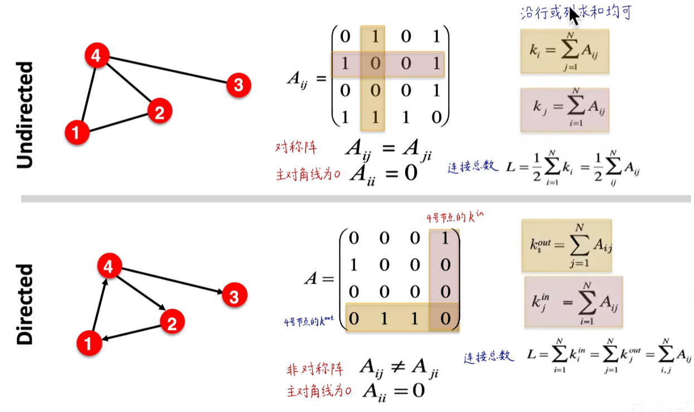
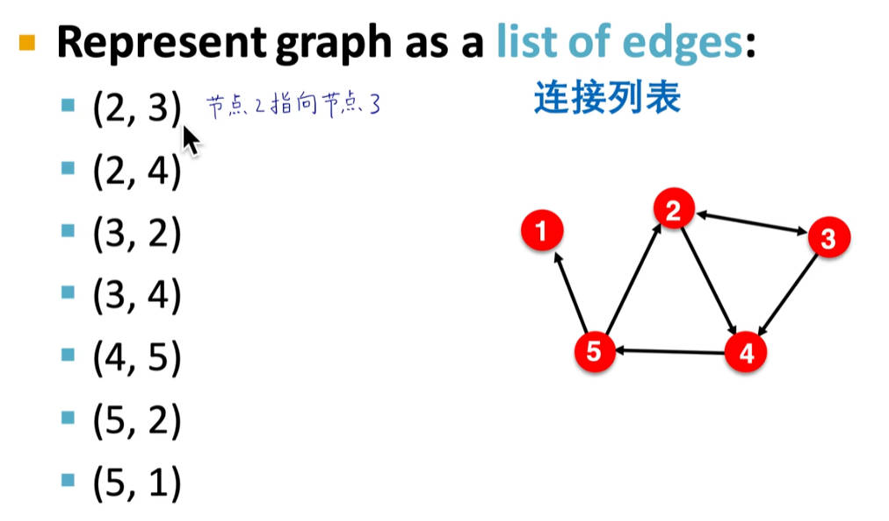
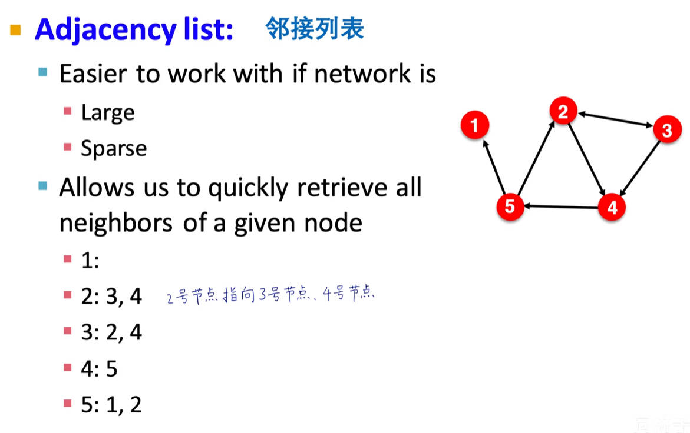
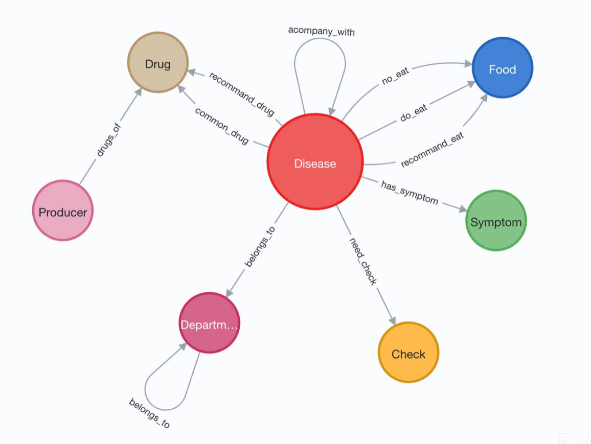
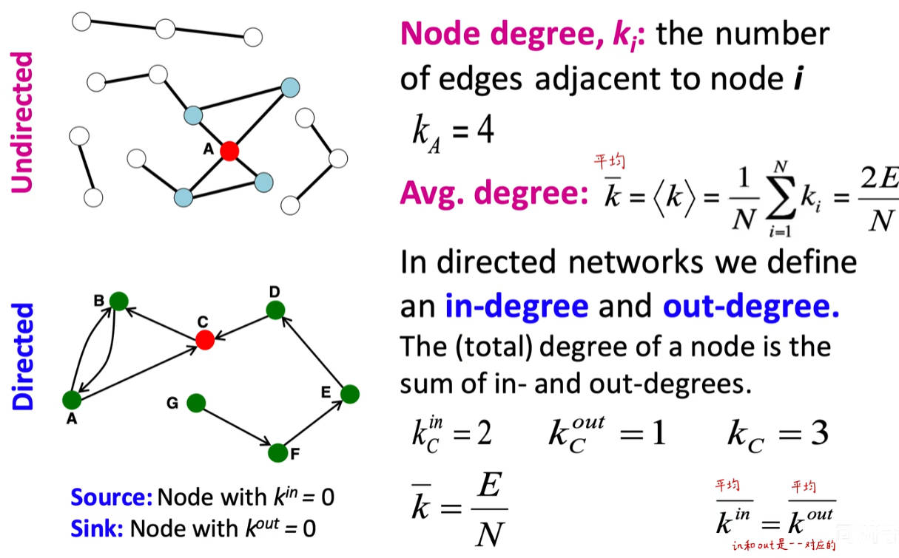
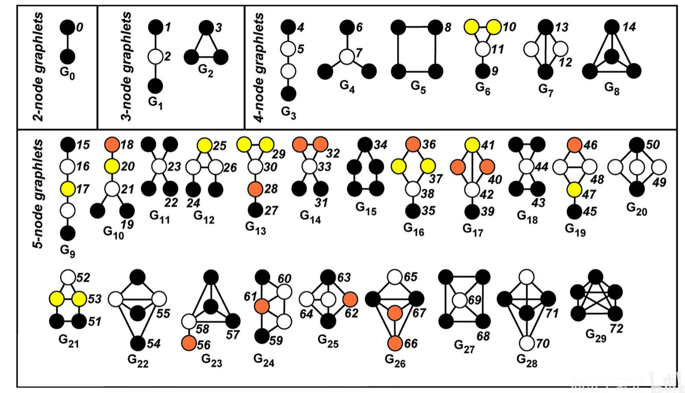
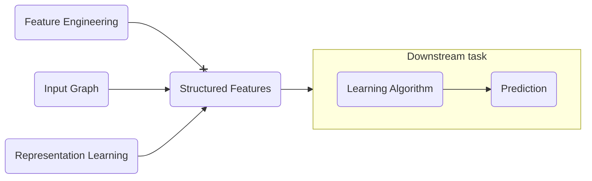

### Why graphs  
> Many Types of Data are  Graphs  

> Graph is the common natural language   

### Graph presentation  

#### Adjacency Matrix  
> N nodes, the matrix is nxn(A sparse matrix)   
  

#### Edge list  
  

#### Adjacency list  
  

#### Ontology  
1. How to design node and connections?  
2. Undirected and directed.  
3. A heterogeneous graph, different nodes with different connections.  
  

### Node Degrees  
  

### Connected graph  
> Any two vertices can be joined by path.  

> Strongly connected components: nodes can reach each other.  

### Traditional graph machine learning  

#### Feature engineering  
1. Using effective features over graphs is the key to achieving good model performance.  
2. Traditional ML pipeline uses **hand-designed** features.  

> Node features  
1. Node degree(only care numbers)   
    - Adjacant matrix x [1,1,1...,1] 
2. Node centrality    
    - Eigenverctor centrality  
    - Betweenness centrality  
    - Closeness centrality  
3. cluster coefficient   
4. graphylets  

> Link features  
1. **Katz index**: count the number of walks of all lengths between two nodes.  
    - Use the power of adjacent matrix  

> Graph-level Features  
1. **Color Refinement** 
2. Graph kernels: Measure similarity between two graphs.  

### Node Embeddings  

#### Graph representation learning  
> Goal: Efficient task-independent feature learning for mahine learning with graphs.  

> Encoder: nodes to vectors  
> Decoder: similarity of two vectors

