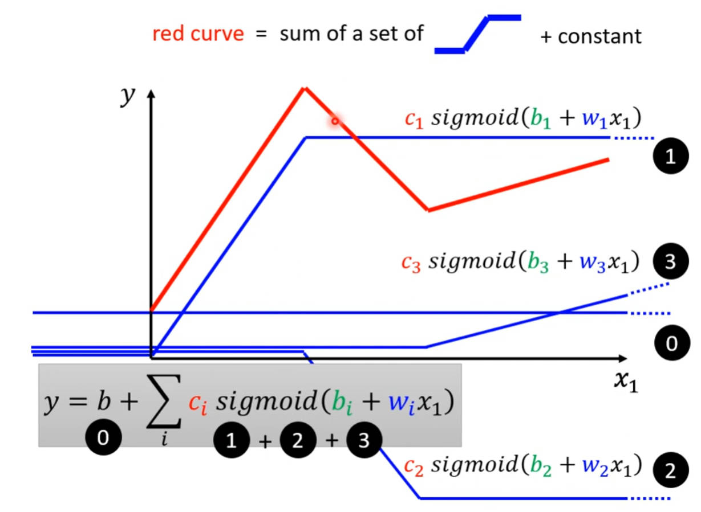
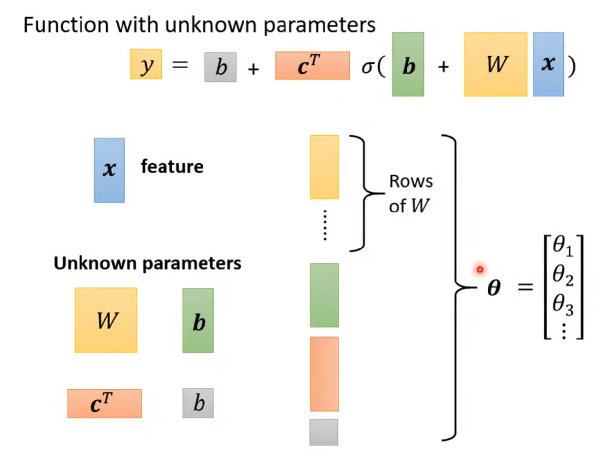
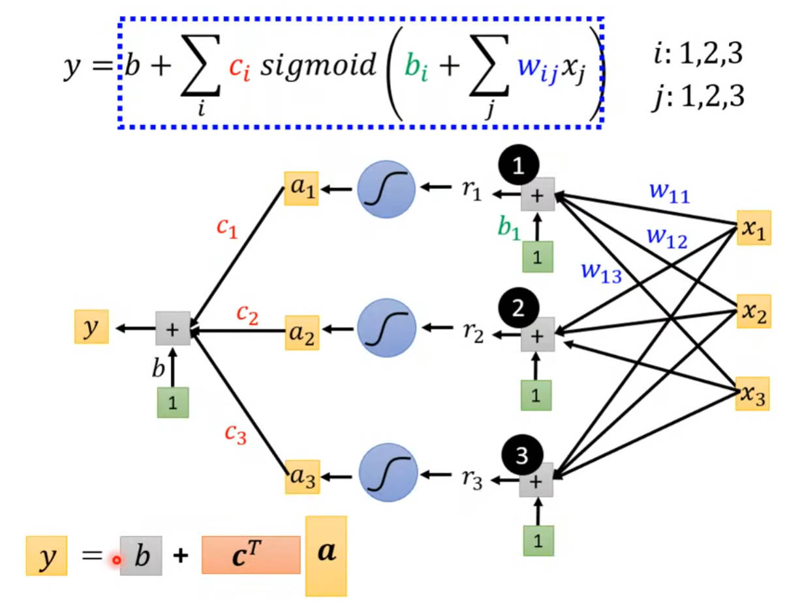
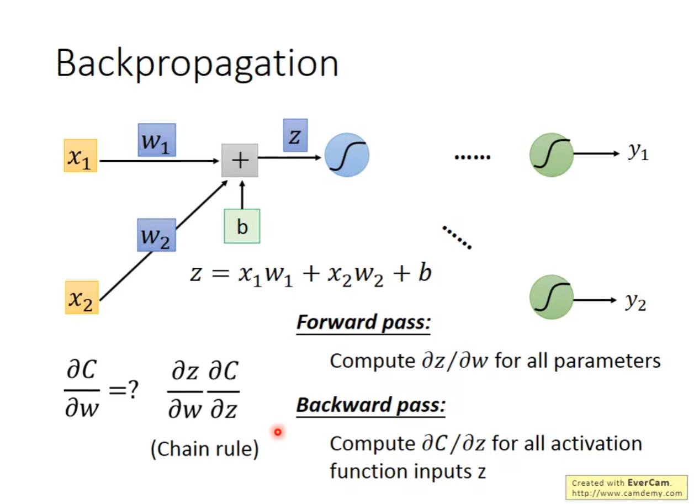
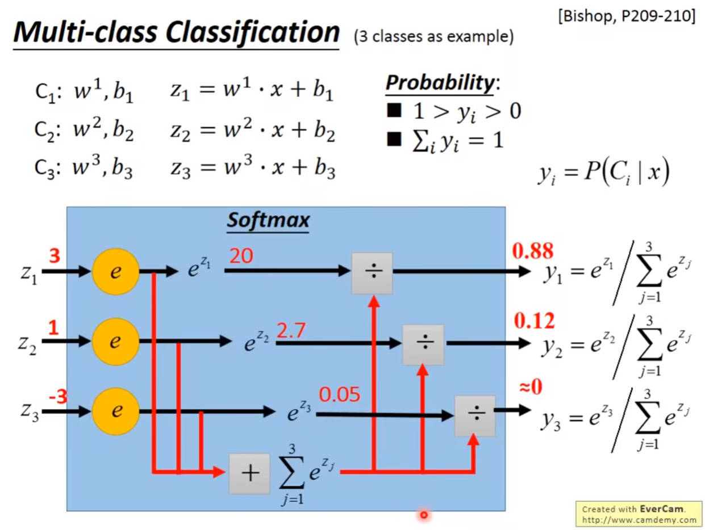
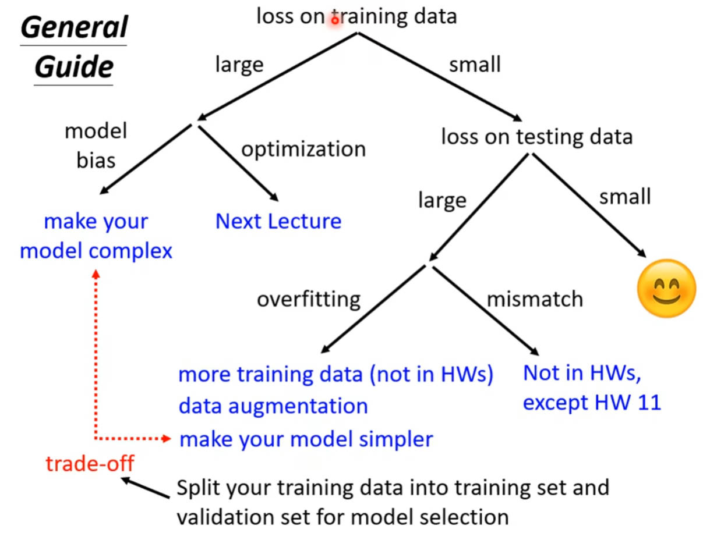

### Machine Learning  
- Looking for a function  

### Types of Functions  
1. Regression: The function outputs a scalar.  
2. Classification: Given options, the function outputs the correct one.  
3. Structure Learning(creative)  

### Loss function(Gradient descend)  
- MAE, MSE, 
- To minimize the Loss  
- $L=\frac{1}{N} \sum_{i=0}^nE$
    - $g=\nabla L(w_0)$
    - $w_1 = w_0 - \eta\times g$
- Regularization: Make function smoother  
- Momentum  
- Error computing  
    - Mean Square Error  
        - $e = \sum_{i=0}(\hat{y_i}-y_{i})^2$
    - Cross-entropy  
        - $e=-\sum_{i=0}\hat{y_i}lny_i$

### Activation Functions  
> A function can be approximately expressed with a set of piecewise functions.  

> Piecewise function can be approximately simulated with sigmoid functions.  

#### Sigmoid Function  
- $y = b + \sum_{i}c_isigmoid(b_i+\sum_jw_{ij}x_j)$
- Provide the ability to simulate any function  

#### Rectified Linear Unit(ReLU) Function  
> Two relu compose a hard sigmoid function.  
- $y = b + \sum_{2i}c_imax(0,b_i+\sum_jw_{ij}x_j)$

  

#### Find suitable function with the selected features  
  

#### Sum of series of Sigmoid function to achieve the truth function    

### Hyperparameters  

## Problems  

### Module bias  

### Optimization issues  

#### Learning Rate  

##### Root Mean Square  

##### RMSProp

##### Learining Rate Decay and Warm up  

### Gradient Descent

#### True Power -- Chain Rule  

### Softmax  

### Train hyper-parameters  

#### Batch Size  
> For an iteration, the train data set with specific size is considered for parameter updating.  
$\theta = \theta - \eta\times\frac{1}{N}\sum_{i}^N$

### General Guide  

#### Overfitting  
> Solutions  

- less parameters, sharing parameters  
- less features  
- early stop  
- regularization  
- dropout  

#### Optimization  

