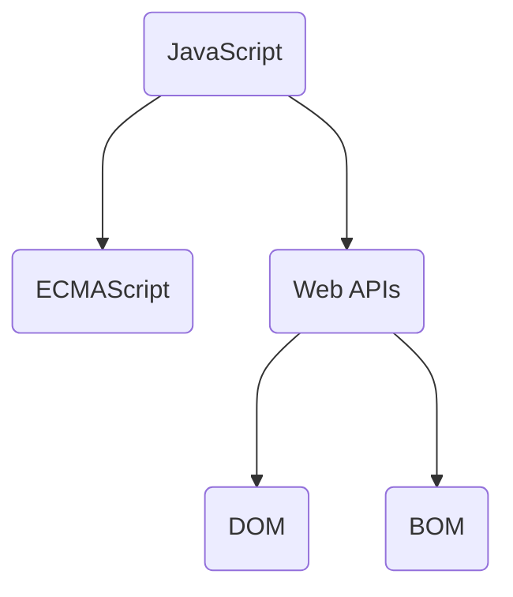
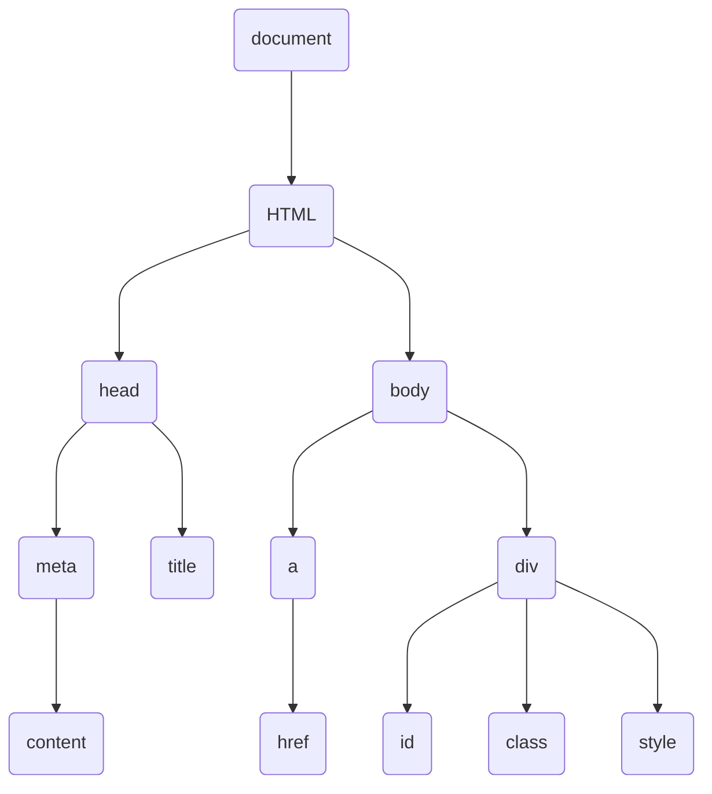
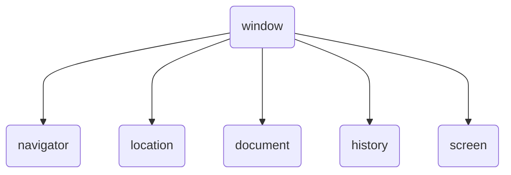

## What is JS?  
- A language running on Browser  

### Position for JS  
1. In `<script>`  
2. A single file dot js  
```JavaScript
<body>
    <script src="my.js">
// Here is omitted  
    </script>
</body>
```
3. Inline for Vue  


### Comment
> The same as Cpp and Java
```javascript
/* 
more line commment
*/
// Single line comment
```

### Declare a variable  
1. `let` declare a scoped variable, prefered to use.  
2. `var` declare a global variable.  
```js
// declare a variable
let var_name;
// Declare a const variable, initial_value is need for initialization
const varible_name = initial_value;
```

### Basic type  
```javascript
/* using typeof to check type */
console.log(typeof variable);
```

#### number  
- Include integer ,float and NaN.  
- Operator includes `+ - * / %`
```JavaScript
let age = 18
let num = 99.9
//NaN
undefined + 1
// valid, res is 1
null + 1
```

#### string 
- Using single quote or double quote  
- Using \` to format string  
- Using `+` to concat  
```JavaScript
let age = 18;
let str = `I am ${age} now`
```
#### boolean 
> ``,0,undefined,null,NaN is false. Others is true.

#### undefined 
> A variable declared without assignment is undefined  

#### null
> For Object, denoting no referrence  

### Type Transform
- `string + any` produce a string  
- `- * /` implicitly produce a number  
```
// The variable should start with number
// Return NaN when invalid
Number(variable);  
parseInt(variable);
parseFloat(variable);
```
---

### Operator  

#### Compare Operator
```javascript
// false
console.log(NaN === NaN);
```

|operator| explain|
|:---|:---|
| == |equal value|
| != | not equal value|
| === | euqal value and type|
|!== | not equal value or type|

#### Logic Operator
1. The logical OR operator evaluates each operand from left to right and returns the value of the first operand that is truthy. If all operands are falsy, it returns the value of the last operand.  
2. The logical AND operator evaluates each operand from left to right and returns the value of the first operand that is falsy. If all operands are truthy, it returns the value of the last operand.  
```java
// Return undefined
console.log(10 && undefined);
// Return 0
console.log(undefined && 0);
```

### Control Flow  
> Like C/C++  

#### if-else  

#### Loop
```JavaScript
while(true){ }
for(INIT;CONDITION;){}
```
### Function
```javascript
// Default value to prevent undefined
function func_name(args=default_value ...){
    ...
}
// call the function
func_name(args...);

// anonymous function, call after assginment
let fn = function(){}
```


### Referrence type  

#### Object
> Also a referrence the same as Java and Python  
```javascript
let obj = {
    key: value,
    func_key: function(){}
}


obj['new-field'] = new-value; // access or add a field
delete obj.field;             // delete field, rarely use
obj.func_key();               // Call the function in Object
```

#### Travel Object
```javascript
// obj can be array
for(let key in obj){
    console.log(key);  //key is string
    console.log(obj[key]);
}
```

#### Array  
> Array is an type of Object

```JavaScript
//data type can be different
let var_array = [...];

// Method
1. Type& operator[int]       // Index 
2. Length push(ele...)       // add to end
3. Length unshift(ele...)    // add to begin
4. LastValue pop()           // remove the last ele
5. FirstValue shift()        // remove the first el
6. void splice(begin,number) //remove n at begin, if number is not specified, remove all after begin

7. array map(fn(ele,index){
    //every element changed
    return ele + 'color';
});

8. string join(separator='');
9. void forEach(func(ele,index))
10. operator[index]      //you can specify index out of range and assign to it, blank position will be empty;

// Field
1. length
```

#### Math  
- Method  
    1. ceil  
    2. floor  
    3. round  
    4. abs  
    5. pow  
    6. sqrt  
- random
    > Return a number in [0,1)  

----

## Web API

### BOM and DOM  
- Browser Object Model  
- Document Object Model -- Manipulate HTML  


#### DOM Tree  
- All html tag will generate a object for js operation  


### Get DOM object by css selector
- document.api

|method|explain|  
|:---|:----|
|querySelector(selector)|Get the first element matched|
|querySelectorAll(selector)|Get all elements matched, return an pseudo array, use for to iterate|  
|getElementById('id')|Get an element by id|  
|getElementsByTagName('tag')|Get all element specified|  
|getElementsByClassName('class')|Get all element in possession of class|  

### Operation On Node Object  
- Modify `src href` for image  
- Modify `style.size`, value is string with css Metric  
```JavaScript
let node = document.querySelector('p')
node.innerText = "hello world"
```

### classList
```javascript
const div = document.querySelector('div');
div.classList.add('active');
div.classList.remove('active');

//if not exists, then add, otherwise remove
div.classList.toggle('active');
```

### Self-defined attribute for Node  
```html
// data-<tag>
<div data-id='1' data-age='9'>hh</div>
<script>
const one = document.querySelector('div')
console.log(one.dataset['id'])
console.log(one.dataset['age'])
<script>
```

### SetTimeEvent
```javascript
let timer = setInterval(fn,1000);
clearInterval(timer);
//可以不清除
let timeout = setTimeout(fn,1000);
```

### EventListener
> obj.addEventListener('event-type',func);   
> bind freely, no covering  
> use obj.removeEventListener('type',func-name), but anonymous func cann't be removed.

|Event|explain|
|:---|:---|
|click||
|mouseenter||
|mouseleave||
|focus|表单获得焦点|
|blur|表单失去标点|
|keydown||
|keyup||
|input|用户输入|
|load|资源已加载|
|DOMContentLoaded|HTML文档已加载|
|scroll||
|submit|表单提交事件|

```javascript
    node.addEventListener('click',function(){
        node.style.display = 'none';
        // use this
        //this.style.display = 'none';
    });
```

### Event Object & this
- Each Function has `this` object  
- `this` often points to the caller  
- Bulle: When a event happened, the all ancestor will response to the same event.  
- Multiple listeners on an event can exist concurrently.  
```javascript
// check event object and this object
obj.addEventListener('click',function(e){
    console.log(e);
    //this point to obj which is caller
    console.log(this);
    //prevent event bubble
    e.stopPropagation();
    //prevent default behaviour
    e.preventDefault();
});
```

### Operation on DOM  
> result the same as querySelector
```javascript
let = obj.parentNode.parentNode...;
obj.previousElementSibling;
obj.nextElementSibling;
obj.children;  //the all 

//create node
const node = document.createElement('tag');

//add node
fatherNode.appendChild(node);
fatherNode.insertBefore(node,target-before-node);

//copy node, if bool is true copy the children together
const obj = node.cloneNode(bool=false)

//delete node by father
fatherNode.removeChild(node);

```


### BOM



### Test mobile
```javascript
(function(){
    const userAgent = navigator.userAgent;
    const android = userAgent.match(/(Android);?[\s\/]+([\d.]+)?/);
    const iphone = userAgent.match(/(iPhone\sOS)\s([\d_]+)/);
    if (android || iphone)
        location.href =  'http://m.itcast.cn';
})();
```

## Advanced JS  

### Closure  
> `Closure = InnerFunction + DataOfOutterFunction`  
> Outsides could access the local data in a function  
> Possiblily leading to memory leakage  
```JavaScript
function outer(){
    let count = 1
    function fn(){
        count++
    }
    return fn
}
const res = outer() // res is a closure here
res()               // count is 2 in this closure
res()               // count is 3 in this closure
```
### Var and Function lift  
- All function declarations will be lifted to the top.  
- All variable declarations via `var` will be lifted to the top.  
```JavaScript
// bar is undefined here
bar()
var bar = function(){
    console.log('bar is undefined')
}
```

### Function arguments  
- Dynamic args list (Only exists in Function)  
- Arguments expansion (Lambda also owns it)  
```JavaScript
function sum() {
    // arguments is a pseudo array
    console.log(arguments)
    let res = 0
    for(let i=0;i<arguments.length; ++i){
        res += arguments[i]
    }
    return res
}
sum(2,3,4,5,6)

function operate(a,b, ...rest){
    //rest is [3,4,5], true array
    return a+b  
}
operate(1,2,3,4,5)

const arr = [1,2,3,4,5]
console.log(...arr)  //expand this array, reverse operation
console.log(Math.max(...arr))

const arr2 = [6,7]
const com = [...arr,...arr2] //concat an array
```

### Lambda 
- `this` in lambda point to the `this` in up-scope  
- In EventListener,Constructor and Prototype func, use function instead of Lambda  
```javascript
const fn = x =>{};
const f = (x,y) => {};
const simple = x => console.log(x);
const ff = x=> x+x;

//return an object
const objNew = (name) => ({name});
```


### Array destruct
> Quickly assgin to variables
```javascript
const arr = [1,2,3];
const [a,b,c] = arr;
console.log(a);
console.log(b);
console.log(c);

let a = 1;
let b = 2;
[b,a] = [a,b]  // Swap value
```

### Object destruct
```javascript
const {a,b} = {a:'hh',b:'gg'};

//use new_var_name to receive hh
const {a: new_var_name,b} = {a:'hh',b:'gg'};

//multiple level destruct
const pig = {
    name: "peiqi",
    family:{
        mother: "pig ma",
        father: "pig pa"
    },
    age: 6
}
const {name, family: {mother,father}} = pig;

// Get the data and rename it as mydata
function processResponse({ data: mydata }){
    console.log(mydata)
}
response.then(res=>processResponse(res))
```

### Object Constructor
```javascript
function Pig(name,age,gender){
    this.name = name;
    this.age = age;
    this.gender = gender;
}

//save memory
Pig.prototype.func = function(){
//this point to instantiation
}


const peppa = new Pig('pig',1,'male');

//static field
Pig.eye = 2;
//static method
Pig.sayHi = ()=>console.log('hi');
```


### Object static method
```javascript
array keys(target_obj);
array values(target_obj);
void assign(dest,source_obj);
```

### Prototype for function sharing  
```JavaScript
Array.prototype.max = function (){
 return Math.max(...this)
}
const arr = [1,2,3]
arr.max()
```


### What does `this` pointer points to?
- In normal function  
- In Lambda  
- In `strict` mode  

### Change the this pointer  
- use `bind`
```JavaScript
const btn = document.querySelector('button')
btn.addEventListener('click',function(){
    this.disable = true;
    // use bind
    setTimeout(function(){
        this.disable = false
    }.bind(this),2000)
    // or use lambda
    setTimeout(()=> this.disable = false ,2000)
})
```

