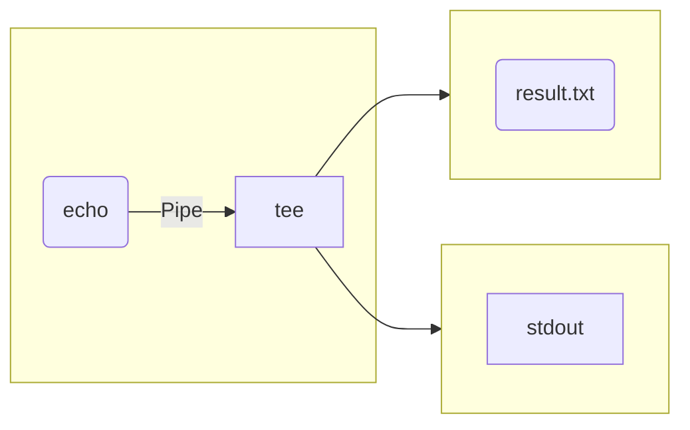

### Scan ip
```shell
//umask is 255.255.255.0 8*3 = 24
nmap -sn 192.168.1.0/24
//or
nmap -sP IP-Range

//umask is 255.255.240.0 2*8+8-4=20
//-v is verbose   
nmap -v -sn 192.168.xx.0/20
```

### Scan Port
- `nmap -sT IP -p-`  
- `nmap -sS IP -p-`  

### Finding plc
> `nmap -sn 192.168.31.0/24 | grep for | cut -d ' ' -f5,6`

### Trace Route  
> `traceroute IP`

### Rename host
> `hostnamectl set-hostname [name]`

### Awesome tools
1. cowsay -f dragon 'hello'
2. cmatrix
3. bastet
4. tldr  
5. neofetch  
6. btop  
7. fzf  

### yes
```shell
yes | sudo apt install ....
```

### ln  
```shell
ln -s [origin] [link]
```

### tee  
> Read from stdin  
```shell
ls | tee result.txt
```



### Process Substitution
- Syntax  
    - `<(...)`:Represents the output of a command as a file for reading.
    - `>(...)`:Represents the input to a command as a file for writing.
- `<(...)` and `>(...)` create a temporary file descriptor and it links to the command's input or output.  
```shell
# as a file-like input
# the output of ls is the input of diff (for reading)
diff <(ls dir1) <(ls dir2)

# as a file-like output
# the input of gzip is the output of tee (for writing)
command1 | tee >(gzip > output.gz) | command2

# see the descriptor 
echo <(echo "hello")
```


### Run a shell script
> Only the third run in current shell environment.  
1. absolute path  
2. bash file.sh
3. source file.sh

### Process manage  
1. ps -aux | less
2. ps -ef | grep  
3. top
4. pstree  
5. btop  

### background task
```shell
cmd &
nohup cmd

# back to foreground
fg

# list the bg job
jobs -l

# restart bg job
bg [num]
```

### File descriptor  
|descriptor|acronym|description|
|:----|:-----|:------|
|0|STDIN||
|1|STDOUT||
|2|STDERR||
```shell
# Redirect standard output (stdout) to a file
echo "Hello, World!" > output.txt

# Redirect standard error (stderr) to a file
ls nonexistentfile 2> error.log

# Combine stdout and stderr
ls validfile nonexistentfile > all.log 2>&1

# prevent output
ls -al > /dev/null
```

### chmod with find
```shell
# for directory
find [PATH] -type d -exec chmod 755 {} \;
find [PATH] -type d | xargs chmod 755

# for file
find [PATH] -type f -exec chmod 666 {} \;
find [PATH] -type f | xargs chmod 666 
```

### Time Zone  
```shell
# Show current timezone
timedatectl

# Show all available timezones
timedatectl list-timezones

# Set new timezone
sudo timedatectl set-timezone Region/City
```

### Change gcc version
- `priority` determines which version is preferred if multiple options are valid (higher number = higher priority).
```shell
sudo apt search '^gcc-[0-9]+$'
sudo update-alternatives --install /usr/bin/gcc gcc /usr/bin/gcc-<version> <priority>
sudo update-alternatives --config gcc

sudo update-alternatives --install /usr/bin/g++ g++ /usr/bin/g++-<version> <priority>
sudo update-alternatives --config g++

# Verify
gcc --version
g++ --version
```

### Detect gcc version of kernel  
```shell
cat /proc/version
```

### tldr  
```shell
tldr --update
```

### watch gpu status  
```shell
watch -d -n 1 nvidia-smi
```

### User Manage  
```shell
# See all user info for last login
lastlog

# -m    create home directory if not exists  
# -s    specify shell  
useradd [name] -m -s /bin/bash

# change password for a user  
passwd [name]

# -r    remove home directory  
userdel -r [name]

# identify a user  
id [name]

# change current user
su - [name]

# who am i -- more detailed
whoami
```

