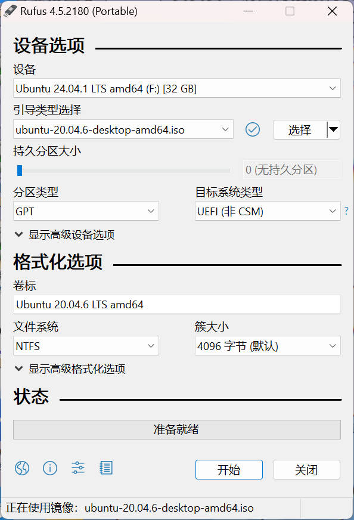
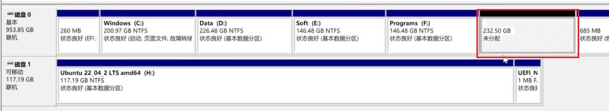

### Download Ubuntu ISO  
> Find the [LTS version](https://releases.ubuntu.com/20.04/) satisfying your need.  


### Create bootable USB flash drives.  
1. Download [rufus](https://github.com/pbatard/rufus)  
2. Plugin a USB and then Open rufus.   


### Windows Settings for prerequisite  
1. Check the BIOS mode is UEFI  
2. Close device encryption  
    1. Click Settings  
    2. Search `bitlock` then close it 
3. Change the function of power button  

4. In windows security center  
    1. Device Security  
    2. Securely start 

### Allocate a disk for ubuntu in windows  
1. Right click on `This Computer` and click `Manage(G)` 

2. Create a unallocated disk  


### Enter Bios  
1. Common keys to try are Del, F2, F10, or Esc.  
2. click on the Start menu and go to Settings. Once here, click on “Update”, and then select “Recovery.” Under “Advanced Startup”, select “Restart Now.” This will restart your computer and bring you to the BIOS menu.
3. Change the Order of Start in Boot Item  
    1. Lift the USB the the top  
    2. Save and exit  

### Install Ubuntu  
1. Start PC and select Ubuntu to start  
2. In install type, select other option  
    1. Find the free space we just prepared.  
    2. Select it and click `+`.  
        1. All are mounted on / with Ext4.  
        2. Select boot installation on Windows boot manager
        3. Check and then install now.  
3. After installation  
    1. Unplug the USB  
    2. Enter BIOS setting to lift Ubuntu first to first order.  


### Activate Root  
```
sudo -i  
sudo passwd root  
```

### Remove Ubuntu  
1. Enter Windows  
2. Find disk manager, delete the volumn of Ubutun  
3. Open terminal with adminstrator permission(To show Boot, diskpart if no such cmd found)  
    1. list disk  
    2. select disk [num of UEFI]
    3. list partition  
    4. select partition [num of boot]
    5. assgin letter=G  
    6. Open note with adminstrator permission  
    7. Open and find the G disk and remove ubuntu directory  
    8. back to terminal: remove letter=G


### Install Nvidia Driver  
- You can install it when installing via the installation wizard.  
- You can install it from nvidia website, just follow its wizards. Some operations maybe happen:  
    1. Reboot for driver overwritten.  
    2. Set CC for the version the same as kernal version.  
- Change Cable to DP or HDMI after installation and reboot.  

### Install cuda-toolkit  
- Use Runfile to install. (Caution: No driver selection for installation)  
- You can remove it via `/usr/local/cuda/bin/cuda-uninstall`  


### Install cudnn  

### Install libtorch  


