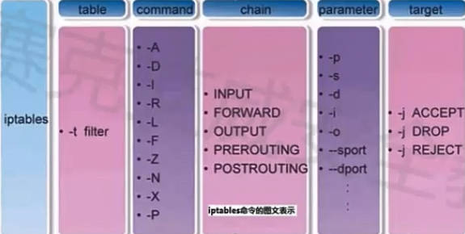
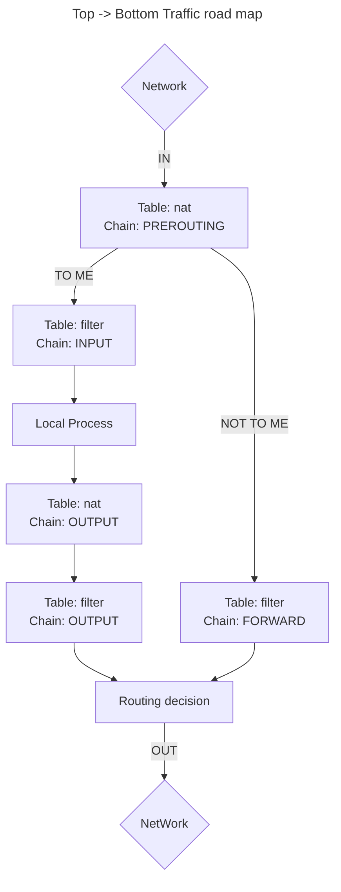

### Basic  

```shell  
iptables [-t filter] -L
iptables -t nat -L

iptables -t filter -I INPUT -s IP -p tcp -dport 3306 -j DROP
iptables -t filter -D INPUT index

#prevent docker
iptables -t filter -I DOCKER -s IP -p tcp -dport [container-port] -j DROP
```

### Architecture  
1. Four tables with five chains  
2. Table order: raw --> mangle --> nat --> filter  


