### 1. View from a function set  
1. **Definition**. A system of equations is called *inconsistent* if it has no solutions. It
is called *consistent* otherwise.

2. In general, the solutions of a system of equations in n variables is the
**intersection** of “(n − 1)-planes” in n-space.  

3. **Theorem**. Every matrix is row equivalent to one and only one matrix in reduced row
echelon form

4. *The Row Echelon Form of an Inconsistent System*. An augmented matrix corresponds to an inconsistent system of equations if and only if the last column (i.e., the
augmented column) is a pivot column.

5. **Definition**. Consider a consistent system of equations in the variables x1 , x2 , . . . , xn .  Let A be a row echelon form of the augmented matrix for this system.  We say that xi is a *free variable* if its corresponding column in A is not a pivot column.

6. Number of Solutions  
    1. The last column is a pivot colum  
    2. Every column except the last column is a pivot column  
    3. The last column is not a pivot column, and some other column is not a pivot column either  

---

### 2. Systems of Linear Equation: Geometry   
---
1. What is the set of solutions to Ax = b?  
    1. For a given b, x is a set of coefficient of all linear combinations of columns of A.  
    2.  Asking whether or not a vector equation has a solution is the same as asking if a given vector is a linear combination of some other given vectors
---
2. What is the set of b so that Ax = b is consistent?
    - The set of b lies in the column space of A.  
---
3. Why make the distinction between points and vectors? A vector need not start at the origin: it can be located anywhere! In other words, an arrow is determined by its length and its direction, not by its location.  
---
4. ***Essential Definition***. Let v1 , v2 , . . . , vk be vectors in $R^n$ . The span of v1 , v2 , . . . , vk is the collection of all linear combinations of v1 , v2 , . . . , vk , and is denoted Span{v1 , v2 , . . . , vk }.

---

#### 2.1 Three characterizations of consistency  
1. A vector b is in the span of v1 , v2 , . . . , vk .
2. The vector equation x1 v1 + x2 v2 + ··· + xk vk = b has a solution.
3. The linear system with augmented matrix is consistent.   

---

#### 2.2 Homogeneous and inhomogeneous systems  
1. **Definition**. A system of linear equations of the form Ax = 0 is called homogeneous.  A system of linear equations of the form Ax = b for b != 0 is called inhomogeneous(with **particular solution**).

2. A homogeneous system always has the solution x = 0. This is called the **trivial solution**. Any nonzero solution is called **nontrivial**.

---

#### 2.3 Recipe: Parametric vector form (homogeneous case)  
1. Let A be an m × n matrix. Suppose that the free variables in the homogeneous equation Ax = 0 are, for example, x3 , x6 , and x8.   
    1. Find the reduced row echelon form of A.   
    2. Write the parametric form of the solution set, including the redundant equations x3 = x3 , x6 = x6 , x8 = x8 . Put equations for all of the xi in order.  
    3. Make a single vector equation from these equations by making the coefficients of x3 , x6 , and x8 into vectors v3 , v6 , and v8 , respectively.   
    4. In this case, the solution set can be written as Span{v3 , v6 , v8 }.  

2. The set of solutions to a homogeneous equation Ax = 0 is a span.
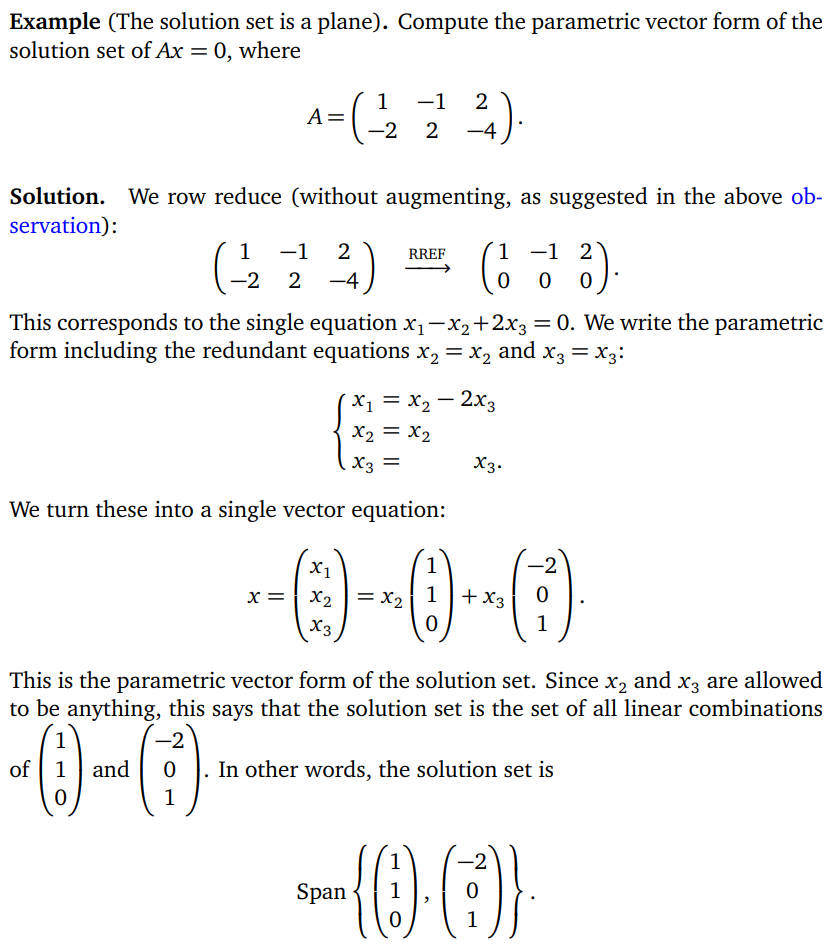

---

#### 2.4 The relationship of Solutions between Ax=0 & Ax=b  
> ***Key Observation***. If Ax = b is consistent, the set of solutions to is obtained by taking one particular solution p of Ax = b, and adding all solutions of Ax = 0.  In particular, if Ax = b is consistent, the solution set is a translate of a span.

---

#### 2.5 Linear Independence  
1. ***Essential Definition***. A set of vectors {v1 , v2 , . . . , vk } is linearly independent if the vector equation x1 v1 + x2 v2 + ··· + xk vk = 0 has only the trivial solution x1 = x2 = ··· = xk = 0. The set {v1 , v2 , . . . , vk } is linearly dependent otherwise.

2. **Theorem**. A set of vectors {v1 , v2 , . . . , vk } is linearly dependent if and only if one of the vectors is in the span of the other ones.  

3. **Theorem** (Increasing Span Criterion). A set of vectors {v1 , v2 , . . . , vk } is linearly independent if and only if, for every j, the vector vj is not in Span{v1 , v2 , . . . , vj−1 }  

---
#### 2.6 Subspace  
1. **Definition**. A subspace of $R^n$ is a subset V of $R^n$ satisfying:  
    1. Non-emptiness: The zero vector is in V.  
    2. Closure under addition: If u and v are in V, then u + v is also in V.  
    3. Closure under scalar multiplication: If v is in V and c is in R, then cv is also in V.  

2. **Theorem** (Spans are Subspaces and Subspaces are Spans). If v1 , v2 , . . . , vp are any vectors in $R^n$ , then Span{v1 , v2 , . . . , vp } is a subspace of $R^n$ . Moreover, any subspace of $R^n$ can be written as a span of a set of p linearly independent vectors in $R^n$ for p ≤ n.

---
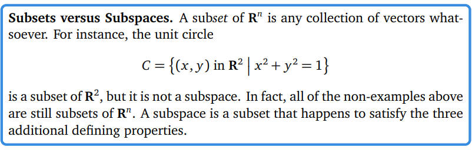
---
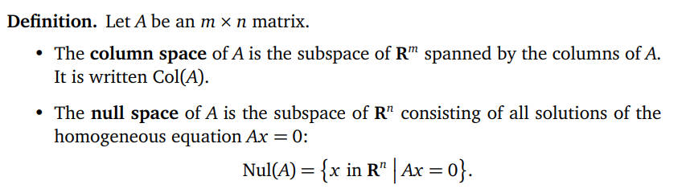
---

#### 2.7 Basis of a Subspace  
1. ***Essential Definition***. Let V be a subspace of $R^n$ . A basis of V is a set of vectors {v1 , v2 , . . . , vm} in V such that:   
    1. V = Span{v1 , v2 , . . . , vm}, and   
    2. the set {v1 , v2 , . . . , vm} is linearly independent.  

2. ***Essential Definition***. Let V be a subspace of $R^n$ . The number of vectors in any basis of V is called the ***dimension*** of V, and is written dim V.

3. **Theorem**. The pivot columns of a matrix A form a basis for Col(A).

4. **Theorem**. The vectors attached to the free variables in the parametric vector form of the solution set of Ax = 0 form a basis of Nul(A).

5. A basis for a general subspace. When given a subspace written in a different form, in order to compute a basis it is usually best to rewrite it as a column space or null space of a matrix.

6. ***Basis Theorem***. Let V be a subspace of dimension m. Then:  
    - Any m linearly independent vectors in V form a basis for V.  
    - Any m vectors that span V form a basis for V.  

---
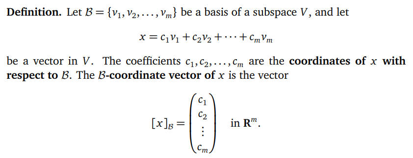  
---

#### 2.8 The Rank Theorem  
> **Definition**. The *rank* of a matrix A, written rank(A), is the dimension of the column space Col(A).  The *nullity* of a matrix A, written nullity(A), is the dimension of the null space Nul(A).

> ***Rank Theorem***. If A is a matrix with n columns, then rank(A) + nullity(A) = n. In other words, for any consistent system of linear equations, (dim of column span) + (dim of solution set) = (number of variables).  

### 3. Matrix Transformations  
1.  Matrices as Functions: Let A be a matrix with m rows and n columns. Consider the matrix equation b = Ax (we write it this way instead of Ax = b to remind the reader of the notation y = f (x)). If we vary x, then b will also vary; in this way, we think of A as a function with independent variable x and dependent variable b.

2. **Definition**. A transformation from $R^n$ to $R^m$ is a rule T that assigns to each vector x in $R^n$ a vector T(x) in $R^m$  
    - R n is called the **domain** of T.
    - R m is called the **codomain** of T.
    - For x in R n , the vector T(x) in R m is the **image** of x under T.
    - The set of all images {T(x) | x in R n } is the **range** of T.}

    The notation T : R n &#8594; R m means "T is a transformation from R n to R m".

3. **Definition**. Let A be an m × n matrix. The matrix transformation associated to A is the transformation.  
    - T: Rn &#8594; Rm defined by $T(x)=Ax$  
    This is the transformation that takes a vector x in R n to the vector Ax in R m

4. **Definition** (One-to-one transformations,$m\ge n$). A transformation T : R n → R m is one-to-one if, for every vector b in R m, the equation T(x) = b has at most one solution x in R n.  

5. **Definition** (Onto transformations,$m\le n$). A transformation T : R n → R m is onto if, for every vector b in R m, the equation T(x) = b has at least one solution x in R n .

    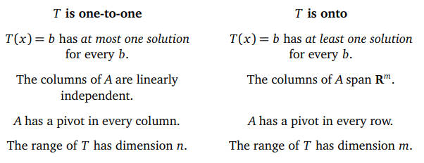  

6. ***Definition***. A **linear transformation** is a transformation T : R n → R m satisfying   
    T(u + v) = T(u) + T(v)  
    T(cu) = cT(u)   
    for all vectors u, v in R n and all scalars c.

7. **Definition**. The n × n identity matrix is the matrix In whose columns are the n standard coordinate vectors in R n

### 4. Determinants  
- Essential Definition. The determinant is a function det : {square matrices} -> R  satisfying the following properties:  
    1. Doing a row replacement on A does not change det(A).  
    2. Scaling a row of A by a scalar c multiplies the determinant by c.  
    3. Swapping two rows of a matrix multiplies the determinant by −1.  
    4. The determinant of the identity matrix In is equal to 1.  

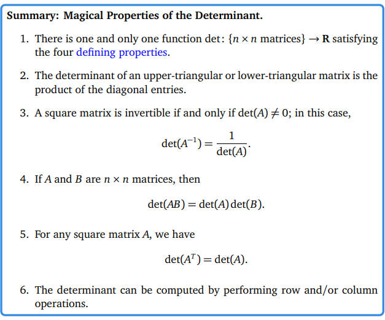

---
### 5. Eigenvalues and Eigenvectors  
> Eigenvectors are by definition nonzero. Eigenvalues may be equal to zero.  
> Eigenvectors with distinct eigenvalues are linearly independent.  

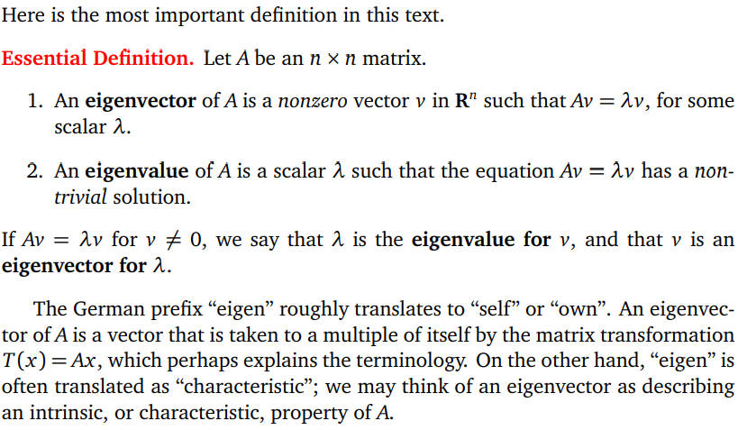  
---

1. **Definition**. Let A be an n × n matrix, and let λ be an eigenvalue of A. The λ-eigenspace of A is the solution set of (A−λE)v = 0, i.e., the subspace Nul(A−λIn)

---
2. **Fact**. Let A be an nxn matrix  
    1. The number 0 is an eigenvalue of A if and only if A is not invertible.  
    2. In this case, the 0-eigenspace of A is Nul(A).
---

3. ***Invertible Matrix Theorem***.   
    1. A is invertible.  
    2. A has n pivots.  
    3. Nul(A) = {0}.  
    4. The columns of A are linearly independent.  
    5. The columns of A span $R^n$ .  
    6. Ax = b has a unique solution for each b in $R^n$ .  
    7. T is invertible.  
    8. T is one-to-one.  
    9. T is onto.  
    10. det(A) 6= 0.  
    11. 0 is not an eigenvalue of A.  
---
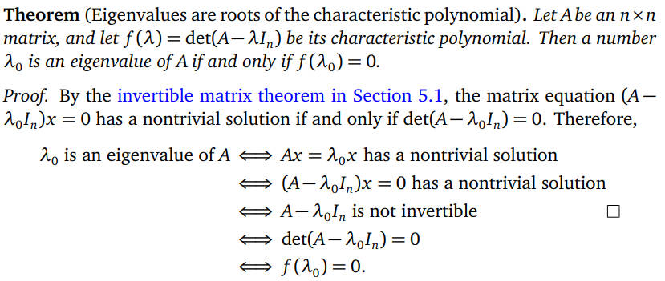  
---

### Similarity  
1. **Definition**. Two n × n matrices A and B are similar if there exists an invertible n × n matrix C such that $A=CBC^{-1}$

2. **Fact**. Let $A=CBC^{-1}$. Then for any n ≥ 1, we have $A^n=CB^nC^{−1}$ .

3. **Similar matrices** have the same eigenvalues.

---
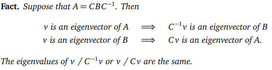  
---
### Geometry of Similar Matrices  
---
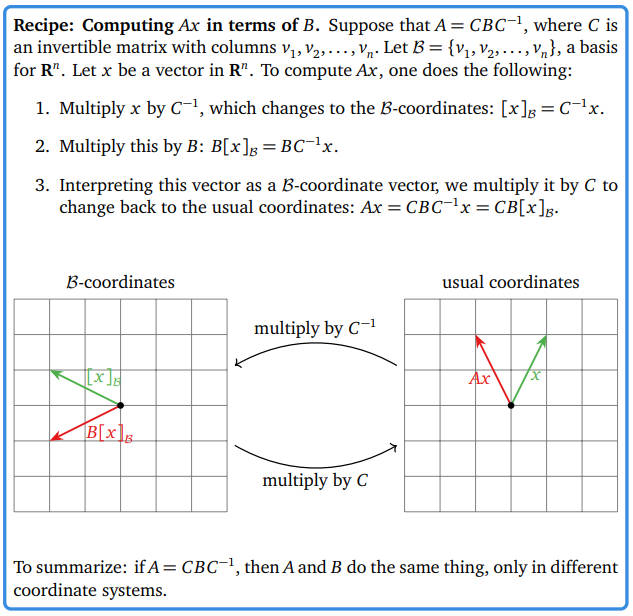  
---

### Diagonalizability  
1. Definition. An n×n matrix A is diagonalizable if it is similar to a diagonal matrix: that is, if there exists an invertible n × n matrix C and a diagonal matrix D such that: $A=CDC^{-1}$

---
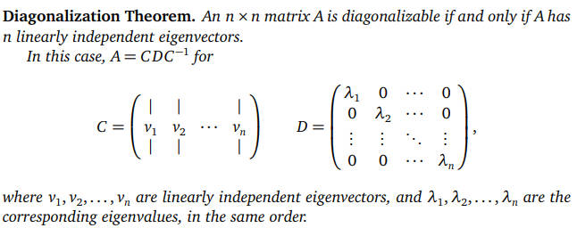  
---
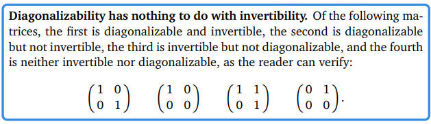  
---

### Stochastic Matrices  
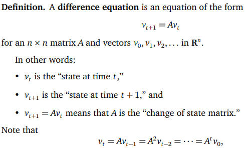

#### Rabbit population Problem 
---
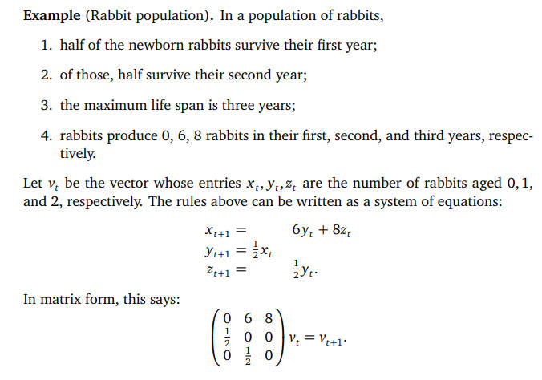
---
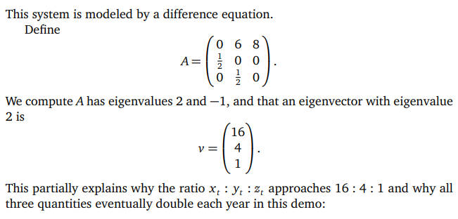

#### Stochastic Matrices and the Steady State  
> **Definition**. A square matrix A is stochastic if all of its entries are nonnegative, and the entries of each column sum to 1. 

> A matrix is **positive** if all of its entries are positive numbers

### Vocabulary  
|word|chinese|  
|:--|:--|
|coordinate|坐标|  
|echelon|梯形|  
|succinctly|简要的|  
|shorthand|速记|
|Non-example|反例|  
|quadrant|象限|  
|Corollary|推论|  
|culmination|巅峰|  
|dilation|膨胀|  
|stochastic|随机的|  

### 

