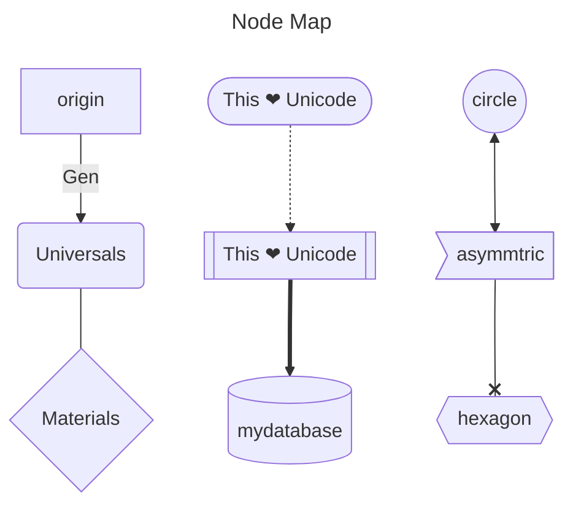
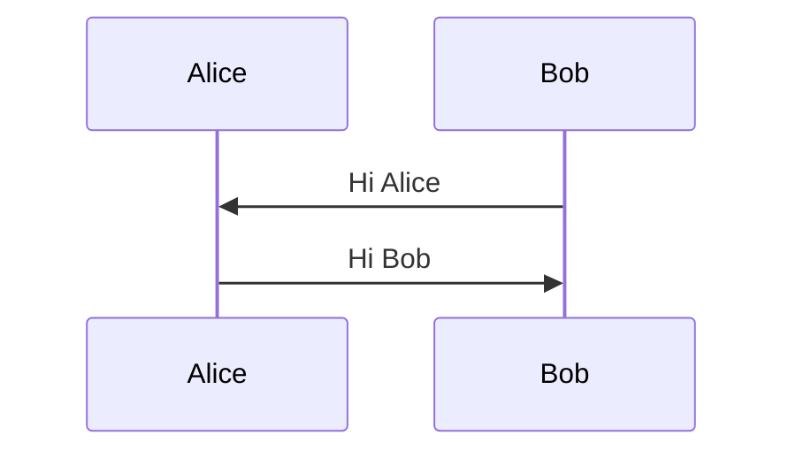
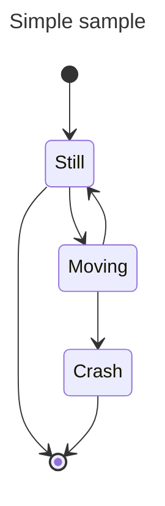
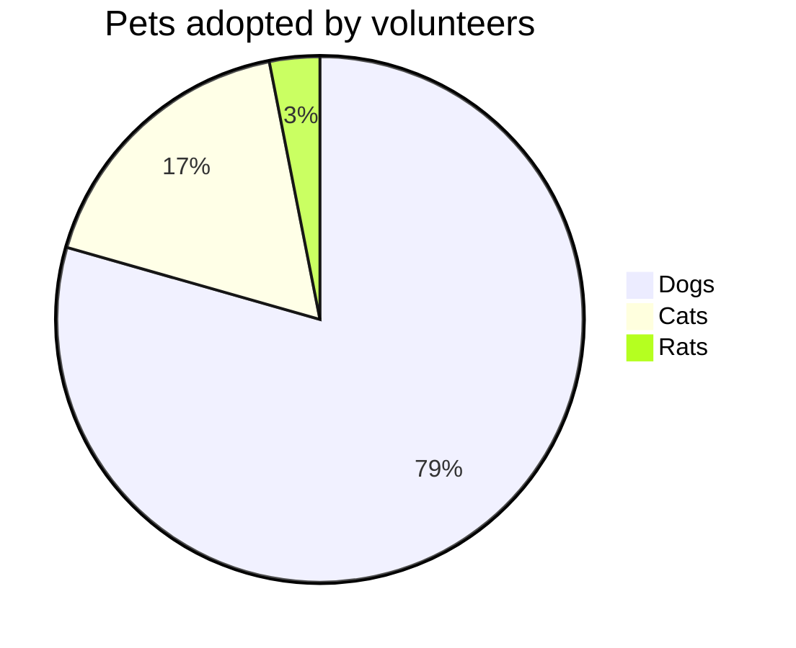

### Basic  

#### Flow chart  
> Direction: T B L R

> Use `%%` to comment  

```mermaid
---
title: Node Map  
---
flowchart TB
    A[origin] -->|Gen| B(Universals) --- C{Materials}

    id1(["This ❤ Unicode"]) -.-> id2[["This ❤ Unicode"]] ==> id3[(mydatabase)]

    id4((circle)) <--> id5>asymmtric] --x id6{{hexagon}}

    %% A & B --> id1 
```

#### Sequence Diagram  

```mermaid
sequenceDiagram
participant Alice
participant Bob
Bob->>Alice: Hi Alice
Alice->>Bob: Hi Bob
                
```

#### State diagrams  

```mermaid
---
title: Simple sample
---
stateDiagram-v2
    [*] --> Still
    Still --> [*]
    Still --> Moving
    Moving --> Still
    Moving --> Crash
    Crash --> [*]
```

#### Pie chart  

```mermaid
pie title Pets adopted by volunteers
    "Dogs" : 386
    "Cats" : 85
    "Rats" : 15

```

