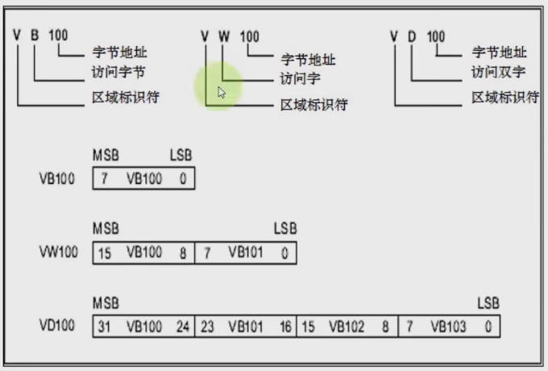
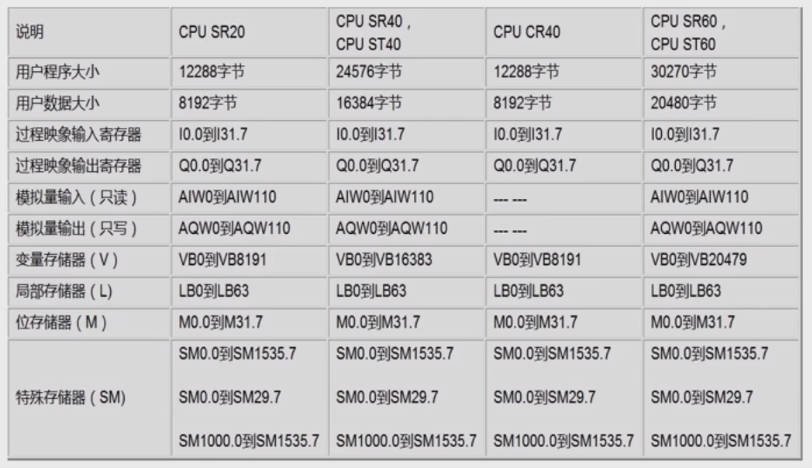

### Help  
> Select the confusing block, then press F1  

### Data Type  
|Type|Number of bit|Explain|  
|:--|:--|:--| 
|BOOL|1|Unsigned|  
|BYTE|8|Unsigned|   
|WORD|16|Unsigned|  
|DWORD|32|Unsigned|  
|INT|16|Signed|
|DINT|32|Signed|  
|REAL|32|Signed|  

### Address Look-Up  
- Byte number to look up  

### SM series   

|Type|Explain|  
|:--|:--|
|SM0.0|False in the first scan then True|  
|SM0.1|True in the first scan then False|  

### Bit operation  
|Type|Explain|  
|:--|:--|
|NOT|!|
|P|Allow up, 0 to 1|  
|N|Allow down, 1 to 0|  
|S|Set 1 for specific successive bits|
|R|Reset 0 for specific succesive bits|

### Teleport  
> Assign value  

### Transform   
> Data Type Conversion  

### Comparison  

### Clock  
> Data Type is INT  
> Different Resolution(1ms,10ms,100ms)  

1. TON(100ms)  
    > Times x Resolution = Total Time  
    > Restore when no electricty
2. TONR  
    > Times x Resolution = Total Time  
    > Keep time record even no electricty  
    > Using Reset Cmd to Restore  

