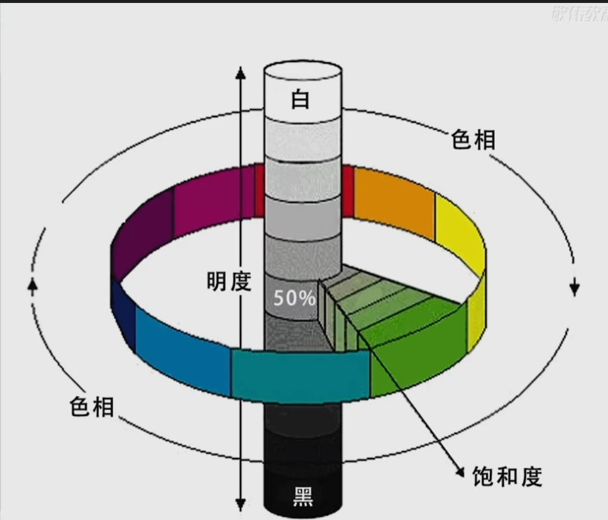

### Shortcuts   
- `Ctrl + K` to open pre-settings  
- `Ctrl + Alt + Shift + K` to open shortcut panel.  
- Press `shift` with a mode key to switch within the specific mode  

|Mode|Explain|
|:--|:--|
|`i`| sucker tool|  
|`v` |pic-layer move|   
|`l` or `m` | select area |  

### View  
- Press `space`  
- `Alt + scroller` to change the scaler  

### Picture layer  
- `Ctrl + Alt + Shift + E` to quickly preview the converge of the visible pictures.  

#### Quick Layer Copy  
- In `v` mode, drag a layer with `Alt`.  
- `Ctrl + J`  

#### Show/Hide layers
1. `Alt + <LC>` on the *eye* to hide other layers , also on mask

#### Mask on a layer  
1. `Alt + <LC>` on the mask to edit visually  
2. `Shift` to disable it
3. Click a layer then press `alt` and move down slightly to create a clip mask  

#### Align layer based on single layer  
1. Select your layers for align  
2. Link them  
3. Select one layer for base then aligning in `v` mode  

#### Group  
- `Ctrl + G` to create a group  
- `Ctrl + Shift + G` to cancel.  

#### Adjustment layer  

### Select Area  
- `m` to enable rectangular select.  
- `l` to enable string select.  
- `w` to enable quick select.  

1. `Ctrl + Shift + J` to cut a select area.(without shift recommended)    
2. `Ctrl` + `<LC>` to generate a select area, clicking on the micro-pic on a layer  

### Color   

#### Hue  
- To adjust a specific color.  
1. shortcut `crtl+u`  
2. Adjustment layer  

#### 色阶(level)
- To control light and shade   
1. To adjust the pixel distribution at white, black and gray field.  

#### Curve
- A function to remap the level.  

### Example  
#### Caption For PR  
1. Create text layer, including zh and en.  
2. Click '图像' and then click vaiable -> define variable.  
3. Select the zh text layer created, and give a name zh for text substitute.
4. Select the en text layer created, and give a name en for text substitute.
5. Click '图像' and then click vaiable -> data set, then import the text file.
6. Click 'file' and then export, '数据组导出'.  
7. Drag the output to PR project.

### Picture layer effects  

### Blend Mode  
- For foreground and background  
- `ctrl + shift + N` to create a neutral color layer.  
1. Dark Group  
    1. Darken : to display the darker   
    2. Mutiply: to kill white, keep dark  
    3. Color Burn
    4. Linear Burn
2. Light Group  
    1. Brighten: to display the brighter  
    2. Color filter: to kill dark, keep white  
    3. Color Dodge  
    4. Linear Dodge  
3. Soft Group  
    1. overlap: to keep in harmony  
    2. Soft light:
    3. Strong light  
    4. Bright light  
    5. Linear light  
4. Aberration Group  
    1. Difference: kill black  
    2. Exclude  
    3. Subtract  

### Select Color  

### Channel mixer  
- Adjust RGB based on RGB channel  
- Adjust CMYK based on CMYK channel  

### Posterization  

### Color Substitute  
- Only for picture rasterized  

